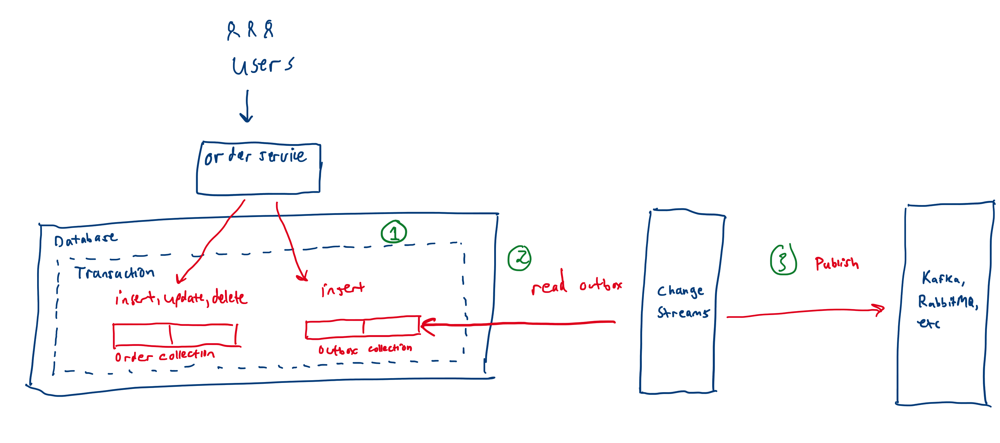
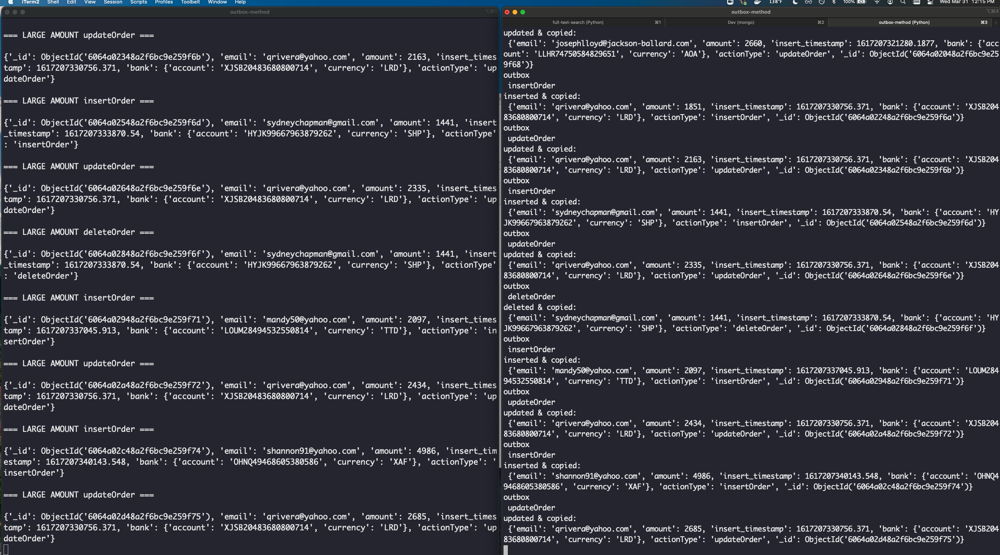

# Outbox Pattern in MongoDB

This is a demonstration of how an application can use MongoDB to create a `transactional outbox` via the outbox pattern. In production, I'd reccommend one use a traditional message broker/pubsub service like Kafka, RabbitMQ, etc. but for the sake of simplicity I've built it using MongoDB's [Change Streams API](https://docs.mongodb.com/manual/changeStreams/).

### What is the Outbox Pattern?

The outbox pattern is used to guarantee that updates to a database and the sending of an event happen atomically.  This is done by using a local transaction which performs the local work AND pushes event(s) into an outbox collection.  The outbox collection is then read by different thread, process, or service to emit events to stream. This will guarantee at-least-once delivery semantics.


*thanks to https://microservices.io/patterns/data/transactional-outbox.html for the diagram*

## Installation

First install your requirements (best practice, is to do so within a virtual environment):

```bash
pip install -r requirements.txt
```

Change the config.py `mongodb-uri` variable to your mongodb instance. I suggest you use [MongoDB Atlas](https://www.mongodb.com/cloud/atlas).

## Usage


In one window run the outbox listener script:

```bash
python outbox-listener.py
```

In another window run the insertion script which randomly performs different actions to the database:

```bash
python perform-actions.py
```

## Outcome

After the process above performs for a minute, take a look at your `outbox` collection, which contains all your events (left window, below).

In addition to this, we have the original transactional data that we put in our database. (right window, below)




## Contributing
Pull requests are welcome. For major changes, please open an issue first to discuss what you would like to change.

Please make sure to update tests as appropriate.

## License
[MIT](https://choosealicense.com/licenses/mit/)
